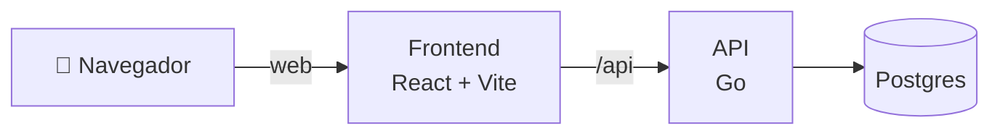

# Chedul

La app de los estudiantes de Ingeniería en Sistemas (UTN FRRe) para organizar la carrera en un solo lugar. Es gratis y no pide datos de SysAcad.

Llevás tu estado académico al día, compartís apuntes con tus compañeros, armás tu semana de cursada y exámenes, y medís cuánto estudiás, todo desde el celular o la compu.

## Qué podés hacer

| | |
| --- | --- |
| 🎓 **Estado académico** | Marcá cada materia como cursando, regularizada o aprobada y mirá cuáles podés cursar según las correlativas. Podés importarlo desde SysAcad sin dar tu clave. |
| 🗺️ **Mapa de correlativas** | Un diagrama de qué materia habilita a cuál, según tu avance. |
| 📚 **Aportes** | Resúmenes, parciales resueltos y links útiles por materia, con búsqueda y favoritos. |
| 📅 **Horarios y calendario** | Tu horario de cursada, fechas de parciales y finales, y sincronización con Google Calendar. |
| ⏱️ **Estudiar** | Pomodoro o cronómetro por materia, meta diaria con medallas, tareas y un ranking opcional. El reloj sigue igual aunque cambies de dispositivo. |
| 🧰 **Herramientas** | Calculadora de electivas, verificador de la Ordenanza 531, mails de profesores y grupos de la comunidad. |

## Cómo funciona



- **Frontend:** React, TypeScript y Vite, pensado primero para el celular.
- **API:** Go, con el plan de la carrera y sus correlativas cargados en la base.
- **Despliegue:** la web en Vercel, la API en Google Cloud Run y la base en Neon. Cada cambio en `main` se publica solo.

## Probarlo en tu máquina

Necesitás la API de Chedul corriendo (repo `chedul-core`) y después:

```sh
pnpm install
pnpm dev      # http://localhost:5173
```

Otros comandos útiles: `pnpm build` para generar la versión de producción y `pnpm lint` para revisar el código.

## Repositorios

- **chedul-frontend:** la aplicación web.
- **chedul-core:** la API y la base de datos.

## Equipo

- **Eduardo Ramírez:** idea, coordinación y desarrollo fullstack. ([eduramirez.dev](https://eduramirez.dev))
- **Lautaro Acosta Quintana:** backend e infraestructura.
- **Tobías Stegmayer:** frontend y diseño de interfaz.
